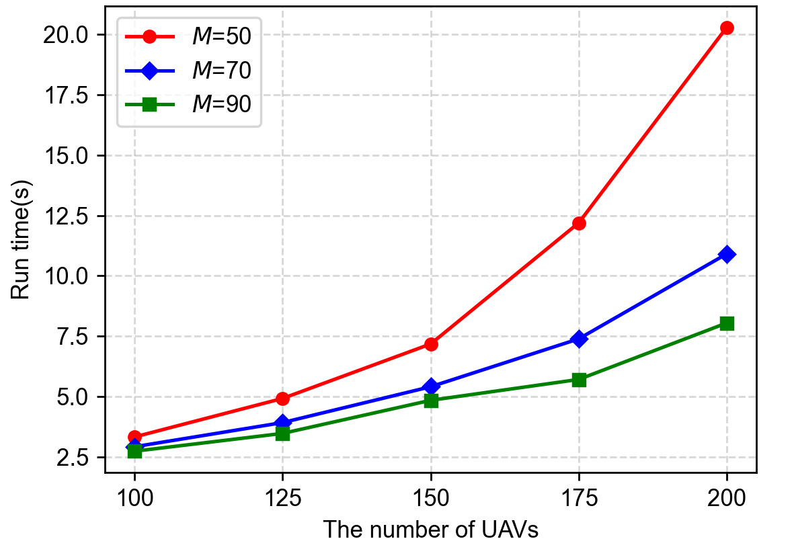

# MUCFC-CFG Algorithm
This is the code for the paper "A Task-Driven Multi-UAV Coalition Formation Mechanism" accepted to AAMAS 2024.

# Introduction
The MUCFC-CFG algorithm is proposed based on coalition formation game, and it can achieve stable coalition division through multiple iterations. In the multi-UAV coalition formation problem, we solve the problem driven by the task by the MUCFC-CFG algorithm.

# File Description

* The `config.ini` file establishes the experimental configuration parameters, allowing for the customization of settings such as the number of Unmanned Aerial Vehicles (UAVs) and tasks, iteration count, and hyperparameters among others.
* The `initiality.py` file defines the parameters for initializing the experiment, where you can tailor the attributes of both the UAVs and the tasks.
* The `Coalition.py` file encapsulates the coalition class, which includes a suite of functions and attributes pertinent to coalition formation and management.
* The classes for UAVs and tasks are delineated in `UAV.py` and `Task.py` respectively, each containing a set of attributes specific to UAVs or tasks.
* The `Solution.py` file houses the algorithm designed to address the problem, encapsulating the logic and methods required for its resolution.

# Usage
When installing Python, which can be directly downloaded from the official Python website, it is advisable to add Python to the environment variables during the installation process to avoid separate configurations later. 

Once Python is set up, you can refer to the `config.ini` file for input instructions. This configuration file serves as a guide for initializing the properties of your experiment. For instance, in our example, we create a text file that enumerates the initialized attributes, detailing the number of UAVs, tasks, iteration rounds, the alpha value, and other pertinent parameters.

Let's proceed to execute the Python code. If you are utilizing a Linux system, the process is straightforward. Simply navigate to the desired directory and follow the following instructions:

    $ ./Main.py 

This approach is also compatible with Windows or macOS systems:

    python Main.py

**Tips**:`PyCharm` is a comprehensive integrated development environment (IDE) tailored for Python programming. It offers robust features for code completion, debugging, testing, and version control. Regardless of whether you use PyCharm or any other IDE, you can simply double-click `Main.py` to open and execute it directly.

# Additional Supplements

In light of the page constraints for AAMAS conference submissions, we have appended additional experimental results in this document. These supplementary experiments offer extended validation and deeper insights into the practicality of our proposed algorithm, further demonstrating its applicability and effectiveness.

Clustering, autonomous, and intelligent coalition formation are recognized as crucial advancements in the evolution of UAVs. The ability of multi-UAV systems to form coalitions enhances task execution efficiency. To ensure these theoretical advancements translate into practical applications, it is essential to validate the scalability of the algorithm by testing its runtime in real-world scenarios. This approach aligns with the findings from the **Unmanned Systems Integrated Roadmap FY 2017-2042 [1]**, which indicates that typical applications involve around **150 unmanned clusters**. By evaluating our proposed algorithm in such a large-scale context, we can confirm its efficacy, as demonstrated by the experimental timing results depicted in the following figure, which are well within the acceptable parameters.

As shown in the above figure, in our experimental setup, the number of UAVs ranges from 100 to 200, and the number of tasks varies between 50 and 90, with the algorithm iterating over 500 rounds. Notably, when the UAV count approximates 150, the algorithm’s runtime remains under 10 seconds. This efficiency is attributed to the manageable computation time of the Shapley value, which determines the utility allocated to each UAV. The average number of UAVs allocated per task stays within an acceptable limit, ensuring that the calculation does not become overly time-consuming. Even as the scale of UAVs expands, necessitating more iterations for convergence, the impact on the overall running time remains minimal, demonstrating the algorithm’s robustness in large-scale scenarios.

**Reference：**

[1] United States Department of Defense. 2018. Unmanned Systems Integrated Roadmap FY 2017-2042. Technical Report. Washington: United States Department of Defense.

